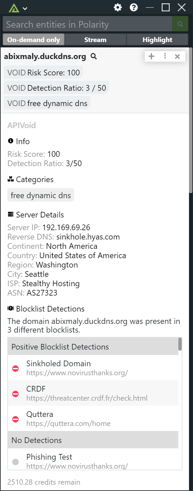
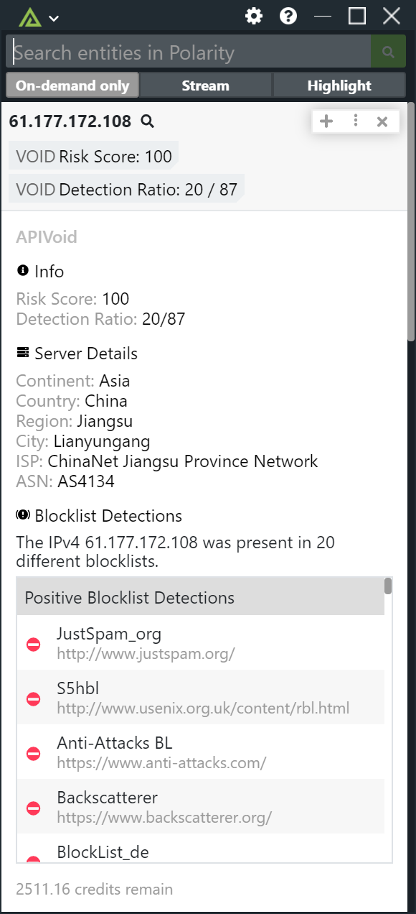

# Polarity APIVoid Integration

Polarity's APIVoid integration retrieves reputation information for IP addresses and domains.  The integration will report if the indicator in question is present in any of the block lists tracked by the APIVoid IP and Domain reputation services.

Please see [APIVoid](https://www.apivoid.com/) for more information.

Check out the integration below: 

|  |
|---|---|
|*Domain Example* |*IP Example*|

## APIVoid Integration Options

### APIVoid API Key
Valid APIVoid API Key. Available via login at https://app.apivoid.com/dashboard/api-keys/

### View Blocklisted Indicators Only
If checked, only indicators with at least 1 blocklist engine detection will be returned to the Polarity Overlay.

## Installation Instructions
Installation instructions for integrations are provided on the [PolarityIO GitHub Page](https://polarityio.github.io/).

## Polarity
Polarity is a memory-augmentation platform that improves and accelerates analyst decision making.  For more information about the Polarity platform please see:

https://polarity.io/
